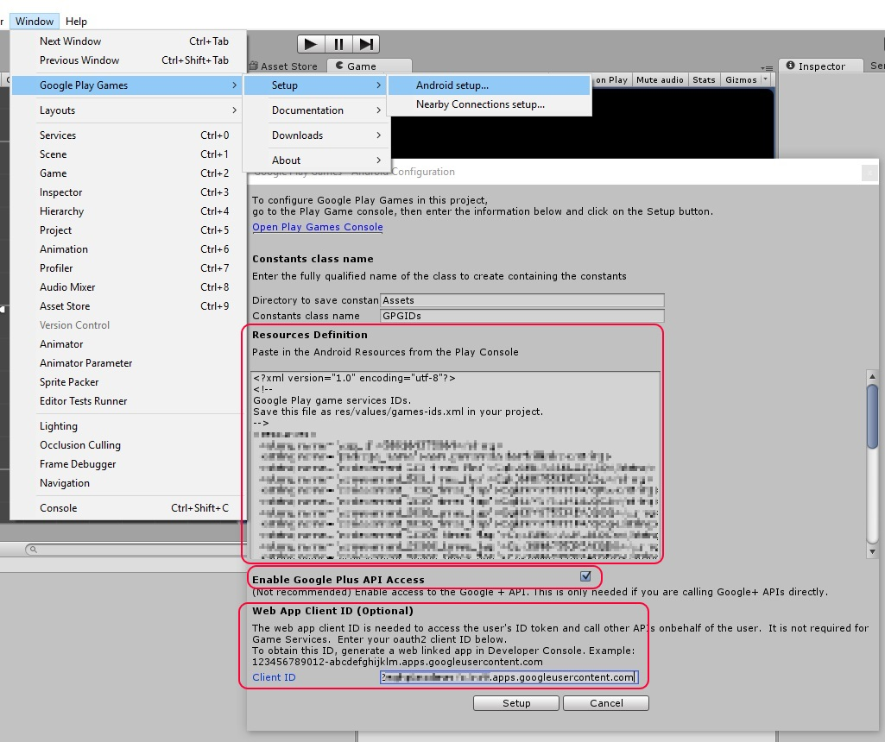

# Gamemela SDK
_Copyright (c) 2016 Funizen Inc. All rights reserved._

## Overview

The GAMEMELA SDK allows you to access the GAMEMELA Services API.
The plugin provides support for the following features of the GAMEMELA API: 
* sign up
* sign in
* sign out

All features are available on Android.

Installation of GamemelaSDK
-----------------------

1. Download GamemelaSDK Plugin for Unity. [[Download](https://github.com/gamemela/GamemelaSDK/raw/master/unity/gamemela-unity-sdk.unitypackage)]  [[History](ARCHIVE.md)]
2. Open your project for Unity.
3. Import downloaded plugin.
4. Gamemela -> Edit Settings
  * 
5. Google Play Games
  * 

GamemelaSDK Built with
-----------------------
1. Unity 5.3.5f1 
2. Android SDK Manager Settings (*)
	* Tools
		* Install Android SDK Build-tools 24.0.1
		* Install Android SDK Tools 25.1.7
		* Install Android SDK Platform-tools 24.0.1
	* None of [preview] things...
	
	

Usage for social features.
-----------------------
### Namespace
	using GamemelaSdk.Unity;

### Sign in
		GM.SignIn((bool success, String message)=> {
			if (success) {
				Debug.Log("Sign in success");
			}
			else {
				Debug.Log("Sign in failed:" + message);
			}
		});

### Help(Customer Services)
		GM.LoadPageHelp();

### Sign out
		GM.SignOut();

# References
-----------------------

_[Facebook SDK for Unity](https://github.com/facebook/facebook-sdk-for-unity)_

_[Google Play Games plugin for Unity](https://github.com/playgameservices/play-games-plugin-for-unity)_

_[Google Analytics Plugin for Unity](https://github.com/googleanalytics/google-analytics-plugin-for-unity)_

_[unity-webview](https://github.com/gree/unity-webview)_

_[Unity HTTP](https://github.com/andyburke/UnityHTTP)_

......

