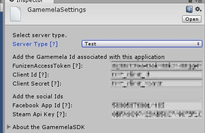

# Gamemela SDK
_Copyright (c) 2016 Funizen Inc. All rights reserved._

## Overview

The GAMEMELA SDK allows you to access the GAMEMELA Services API.
The plugin provides support for the following features of the GAMEMELA API: 
* sign up
* sign in
* sign out

All features are available on Android.

Installation of GamemelaSDK
-----------------------

1. [[Download GamemelaSDK Plugin for Unity.](ARCHIVE.md)]
2. Open your project for Unity.
3. Import downloaded package [gamemela-unity-sdk.x.y.z.unitypackage].
4. Gamemela -> Edit Settings
  * 

Usage for social features.
-----------------------
### Namespace
	using GamemelaSdk.Unity;

### Initialize
		GM.Init(facebookAppId:"");

### Check sign in
		if (GM.IsSignedIn())
		{
			Debug.Log("Gamemela signed in.");
		}
		else
		{
			Debug.Log("Gamemela signed out.");
		}

### Sign in
		GM.LoadPageSignIn((success, message)=> {
			Debug.Log("OnButtonSignInGamemela: " + success + " / " + message);
		});

### Customer Service
		GM.LoadPageCustomerService();

### Sign out
		GM.SignOut();

# References
-----------------------

_[Facebook SDK for Unity](https://github.com/facebook/facebook-sdk-for-unity)_

_[Google Play Games plugin for Unity](https://github.com/playgameservices/play-games-plugin-for-unity)_

_[Google Analytics Plugin for Unity](https://github.com/googleanalytics/google-analytics-plugin-for-unity)_

_[unity-webview](https://github.com/gree/unity-webview)_

_[Unity HTTP](https://github.com/andyburke/UnityHTTP)_

......

